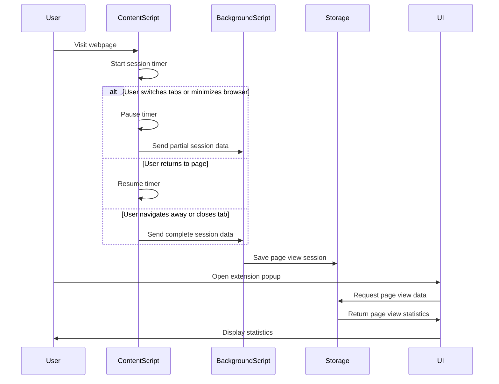

# Design Document: Page View Duration Statistics

## Overview

The Page View Duration Statistics feature will track and analyze the time users spend on individual web pages. This design document outlines the technical approach for implementing this feature, including architecture, data models, and user interface components.

The solution will build upon the existing browser extension infrastructure, leveraging the content script for tracking page interactions and the background script for data processing and storage. The feature will provide users with detailed insights into their browsing habits while ensuring privacy, accuracy, and minimal performance impact.

## Architecture

The feature will follow a modular architecture with the following components:

1. **Time Tracking Module**: Implemented in the content script, responsible for accurately measuring time spent on web pages.
2. **Data Storage Module**: Extends the existing storage manager to handle page view duration data.
3. **Data Analysis Module**: Processes raw page view data to generate meaningful statistics and insights.
4. **User Interface Components**: Displays statistics in both the popup and dedicated statistics pages.

### System Flow



## Components and Interfaces

### 1. Time Tracking Module (Content Script)

The content script will be enhanced to track page view durations accurately:

```typescript
// Enhanced content script interface
interface TimeTracker {
  startSession(): void;
  pauseSession(): void;
  resumeSession(): void;
  endSession(): void;
  detectInactivity(timeoutMs: number): void;
  handleVisibilityChange(): void;
  handleUrlChange(): void;
}
```

Key enhancements:
- Improved URL normalization for SPA route changes
- Inactivity detection to optionally pause tracking during user inactivity
- Enhanced event handling for browser state changes

### 2. Data Storage Module

Extend the existing storage manager to handle page view duration data:

```typescript
// Enhanced storage interfaces
interface PageViewStorage {
  savePageViewSession(url: string, session: PageViewSession, pageTitle?: string, faviconUrl?: string): Promise<void>;
  getAllPageViews(): Promise<PageView[]>;
  getPageViewsByDate(startDate: Date, endDate: Date): Promise<PageView[]>;
  getPageViewsByDomain(domain: string): Promise<PageView[]>;
  deletePageView(url: string): Promise<void>;
  clearAllPageViews(): Promise<void>;
}
```

The storage module will:
- Store page view data efficiently using the browser's local storage
- Implement data aggregation methods for statistics generation
- Provide filtering capabilities by date, domain, and other criteria

### 3. Data Analysis Module

A new module for analyzing page view data:

```typescript
// Data analysis interfaces
interface PageViewAnalyzer {
  getMostTimeConsumingPages(limit?: number): Promise<PageView[]>;
  getDomainTimeDistribution(): Promise<Record<string, number>>;
  getTimeByHourOfDay(): Promise<Record<number, number>>;
  getTimeByDayOfWeek(): Promise<Record<number, number>>;
  getAverageSessionDuration(): Promise<number>;
}
```

This module will:
- Calculate various statistics from raw page view data
- Generate insights about browsing patterns
- Support visualization data for charts and graphs

### 4. User Interface Components

New UI components for displaying page view statistics:

```typescript
// UI component interfaces
interface PageViewList {
  render(pageViews: PageView[], sortBy?: 'time' | 'url' | 'recent'): void;
  handleDelete(url: string): void;
}

interface TimeDistributionChart {
  renderByDomain(data: Record<string, number>): void;
  renderByHourOfDay(data: Record<number, number>): void;
  renderByDayOfWeek(data: Record<number, number>): void;
}

interface DateRangeSelector {
  onRangeSelected(startDate: Date, endDate: Date): void;
}
```

The UI will include:
- Enhanced popup with summary of most time-consuming pages
- Detailed statistics page with filtering and sorting options
- Interactive charts for visualizing time distribution
- Controls for managing tracked data

## Data Models

### Enhanced PageView Model

```typescript
interface PageViewSession {
  startTime: number;
  endTime: number;
  active: boolean; // Whether the user was active during this session
}

interface PageView {
  url: string;
  normalizedUrl: string;
  hostname: string;
  pageTitle?: string;
  faviconUrl?: string;
  sessions: PageViewSession[];
  totalDuration: number; // Total time in seconds
  lastVisited: number; // Timestamp of last visit
  firstVisited: number; // Timestamp of first visit
}
```

### Settings Model Extension

```typescript
interface UserSettings {
  // Existing fields
  collectData: boolean;
  collectionFrequency: "hourly" | "daily";
  excludeIncognito: boolean;
  excludedDomains: string[];
  
  // New fields for page view duration tracking
  trackPageViewDuration: boolean;
  inactivityThresholdMinutes: number;
  pauseOnInactivity: boolean;
  pageViewStorageDays: number; // How many days to keep data
}
```

## Error Handling

The feature will implement robust error handling:

1. **Data Consistency**: Implement validation for all page view data to ensure consistency
2. **Storage Limits**: Monitor storage usage and implement cleanup strategies for older data
3. **Event Handling**: Gracefully handle edge cases in browser events (e.g., crashes, sudden termination)
4. **User Feedback**: Provide clear error messages when operations fail
5. **Recovery Mechanisms**: Implement data recovery for interrupted tracking sessions

Error scenarios and mitigations:

| Error Scenario | Mitigation |
|----------------|------------|
| Storage quota exceeded | Auto-cleanup of oldest data, notify user |
| Invalid URL format | Robust URL normalization with fallbacks |
| Browser crash during tracking | Session recovery on restart |
| Content script injection failure | Retry mechanism with graceful degradation |
| Data corruption | Validation before storage, repair mechanisms |

## Testing Strategy

The testing strategy will cover all aspects of the feature:

### Unit Tests

- Time tracking logic in isolation
- Storage operations with mock data
- Data analysis functions
- UI component rendering

### Integration Tests

- Content script and background script communication
- Storage and analysis module interaction
- UI components with real data

### End-to-End Tests

- Complete user workflows
- Browser state changes (tab switching, closing, reopening)
- SPA navigation scenarios

### Performance Tests

- Memory usage during extended tracking
- Storage efficiency with large datasets
- UI responsiveness with many page views

## Privacy and Security Considerations

1. All data will be stored locally on the user's device
2. Sensitive URLs can be excluded from tracking via pattern matching
3. Incognito mode tracking will be optional and off by default
4. Clear data options will be prominently available
5. No external data transmission without explicit user consent